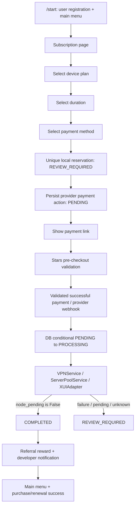

# Telegram E2E audit (offline)

Baseline: commits `920d68e`, `869c5eb`; Python 3.12.12.
No production configuration is loaded. No external API is contacted.

## Flow

There is no FAILED transaction status in this implementation. Failed provisioning
is conservatively REVIEW_REQUIRED, or remains PROCESSING if marking review fails;
stale recovery handles the latter. No automatic provisioning retry is permitted.

## Runtime map

| Step | Runtime code / callback / state |
| --- | --- |
| Registration | `DBSessionMiddleware`, `User.get/create` |
| Start/main menu | `main_menu.handler.command_main_menu`, `callback_main_menu`; `/start`, `main_menu` |
| Subscription | `subscription_handler.callback_subscription`; `subscription` |
| New purchase | `callback_subscription_process`; SubscriptionData.state=`process` |
| Plan/duration | `callback_devices_selected`, `callback_duration_selected`; `devices`, `duration` |
| Renewal/change | `callback_subscription_extend`, `callback_subscription_change`; `extend`, `change`; is_extend/is_change |
| Payment | `payment_handler.callback_payment_method_selected`; CheckoutData flow/provider reference; transient `PaymentState.processing` |
| Stars invoice | `TelegramStars.create_payment`; persisted order ID as invoice_payload, amount/currency/provider snapshot |
| Stars checkout | `pre_checkout_handler` → `TelegramStars.validate_checkout` |
| Stars payment | `successful_payment` → `process_successful_payment`; provider charge binding |
| Other providers | GatewayFactory registers enabled YooKassa/YooMoney/Cryptomus/Heleket; their webhook handlers converge on `_on_payment_succeeded` |
| Claim/completion | `PaymentGateway._on_payment_succeeded`; Transaction conditional DB transitions |
| Provisioning | VPNService.create_subscription/extend_subscription/change_subscription → create_client/update_client |
| Panel ownership | ServerPoolService owns modern XUIAdapter connections; explicit configured inbound |
| Success | NotificationService.notify_purchase_success/notify_extend_success/notify_change_success |
| Key/profile/download | VPNService.get_key/get_client_data; profile and download routers |
| Webhook security | `app.__main__`: same configured secret in set_webhook and native SimpleRequestHandler |
| Admin | IsAdmin/IsDev filters on admin entry/actions; some notification FSM message handlers depend on previously authorized FSM entry |

Selection steps are encoded in SubscriptionData callback data, not durable order
FSM states. Only payment creation has a transient processing FSM state.
Production middleware adds throttling, garbage handling, i18n and maintenance.

## Findings: FIXED

### 1. Duplicate payment selection: FIXED

`CheckoutData` is a compact reference containing a 32-character purchase flow
identity and provider name. Explicit buy/extend/change entry mints a bot/user/
Telegram callback-derived 128-bit nonce before payment selection. Redelivery of
that same entry keeps its nonce. Back navigation and payment selection reuse it;
a new intentional buy/extend/change action produces a fresh nonce. The cart is
held server-side in FSM until reservation, never trusted from the payment button.
After reservation, DB ownership and saved SubscriptionData are authoritative,
even if FSM is lost or catalogue prices change. Old payment buttons without a
flow identity fail closed and ask the user to reopen checkout.

All five gateways inherit one `PaymentGateway.create_payment` implementation:
commit a Transaction reservation with unique purchase_flow_id before ANY provider
invoice I/O. An INSERT/unique conflict rolls back, reads the existing row, and
never calls the provider. A ready PENDING order returns its saved payment_url.
Other states do not create another invoice for this flow. A different user,
provider or cart cannot reuse the reservation. YooKassa also receives the stable
flow ID as its SDK idempotency key; existing provider callback verification is
unchanged. Its external payment ID is bound on the same reserved row, not a new
Transaction. Stars keeps the special one-Star developer amount.

Reservation uses existing REVIEW_REQUIRED rather than adding another status.
Only successful invoice/action persistence changes it to PENDING. Failure,
process death or uncertain provider response leaves REVIEW_REQUIRED with no
payment_url. This means invoice creation needs manual reconciliation, not that
payment was received. No invoice creation retry occurs automatically. For a new
flow, the user must explicitly start checkout again; after ambiguous external
creation they should contact support before paying another invoice.

Migration `d7a2f6c890e1`, parent `c4e91b2a70d5`, adds nullable purchase_flow_id
VARCHAR(32), nullable payment_url TEXT and uq_transaction_purchase_flow. Existing
rows remain NULL; multiple legacy NULL keys are valid. Existing payment identity
constraints and user FK are preserved. Downgrade refuses active non-NULL flows;
completed/canceled/resolved flows permit a clean downgrade preserving purchases.
Payment URLs are stored only in the DB, never in logs/diagnostic repr/docs.

### 2. Review/failure notification: FIXED

The worker that wins PROCESSING -> REVIEW_REQUIRED sends the purchaser a localized
message: payment was received, automatic access could not be issued, the order
needs manual review, and they must not pay again. This covers pending/unknown
activation, False/exception provisioning outcomes and recoverable DB completion
failure. Duplicate paid callbacks do not send a second message or provision again.
No node flags, internal states, errors or credential identity appear in that text.

### 3. Generic error diagnostics: FIXED

Only update ID/type, user/chat IDs, exception type and a fixed redacted-details
marker are logged and sent to the developer. Telegram Update, message/callback
text, checkout payload and payment charge IDs are never serialized. Original
stack frames remain in server diagnostics with a synthetic exception message;
original exception strings/chains and local variables are excluded. Developer
notifications contain only sanitized summary text, no traceback attachment.

### Remaining limits

- Notifications/rewards remain best-effort after a durable state transition.
  A crash or Telegram failure can lose delivery; this patch does not add an outbox.
- Ambiguous external invoice creation/finalize failure requires provider-side
  manual reconciliation. No blind retry is provided. A unique reservation proves
  one application invoice-creation owner, not a provider's internals or billing.
- A fresh intentional checkout can create another order, even for identical
  tariff values. Operators should resolve uncertain earlier invoices first.
- Admin entry denial is tested; every administrative workflow is not exercised.
  Notification FSM steps rely on previously authorized entry; mid-flow permission
  revocation remains a separate review topic.
- Trial/referral/promocode paths use VPNService but are outside this paid harness.
- No runtime py3xui call, first-inbound fallback or unconditional TCP Vision was
  found. Explicit TCP policies and empty-flow XHTTP Reality remain unchanged.
- The preparation cart is in FSM. If lost before reservation, checkout fails
  closed; after reservation, the DB can restore the payment action without FSM.

## Offline harness / coverage

`tests/test_telegram_e2e.py` uses actual Dispatcher routing/filter registration,
DBSessionMiddleware, MemoryStorage FSM, compiled shipped Russian translations,
temporary SQLite + real ORM, TelegramStars gateway, NotificationService,
VPNService and ServerPoolService selection/assignment. Fresh routers avoid
changing global application router ownership.

Telegram BaseSession is a recording fake; invoice creation only returns an
example.test URL. Panel boundary is an async fake returning typed models.
Server health I/O is mocked. A socket-connect guard rejects external connections.
The test DB uses create_all; full migration testing remains in the existing suite.
This does not prove deployed middleware/network delivery behavior or Redis FSM.

| Requirement | Result |
| --- | --- |
| /start → main menu → tariff/duration → payment link + DB snapshot | PASS |
| Stars pre-checkout valid order | PASS |
| Successful payment → node_pending=False → COMPLETED + success message | PASS |
| Sequential/concurrent paid success duplicates → one provision/reward | PASS |
| Duplicate payment selection → single order | PASS: sequential/concurrent and DB replay |
| node_pending=True/None → review, no success/reward/re-provision | PASS |
| Provisioning exception → review, no false success | PASS |
| Review/failure user explanation | PASS |
| Existing subscription UI → renewal update; UUID/subId/membership preserved | PASS |
| Wrong user/order/amount/currency, malformed callback, unknown message | PASS: no provisioning |
| Non-admin admin entry | PASS |
| Native webhook correct secret accepted; wrong/missing rejected before dispatch | PASS |
| Error diagnostics avoid raw payment update | PASS |

Additional existing tests verify adapter wire contracts, multi-membership
preservation, invalid input and webhook secret log handling. They remain part
of the complete regression run; they are not additional production evidence.

## Decision

**READY_FOR_REVIEW**. All three findings have runtime fixes and local regression
coverage. No Telegram/payment/panel production request, production DB/Redis
mutation, migration, commit or push was performed.

## Local verification

Locked Python 3.12.12: 258 tests passed, zero skips. Poetry lock validation,
pip dependency validation and whitespace checks passed. Alembic has one head,
`d7a2f6c890e1`; temporary SQLite upgrade/downgrade tests passed.
Tests exercise real SQLite unique constraint conflicts,
independent engines, separate OS process reservation owners and actual provider
request builders behind local transport mocks. No AST fake establishes the new
purchase flow concurrency guarantee.
